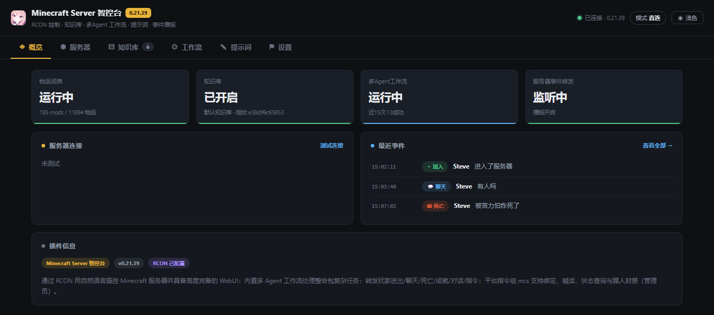
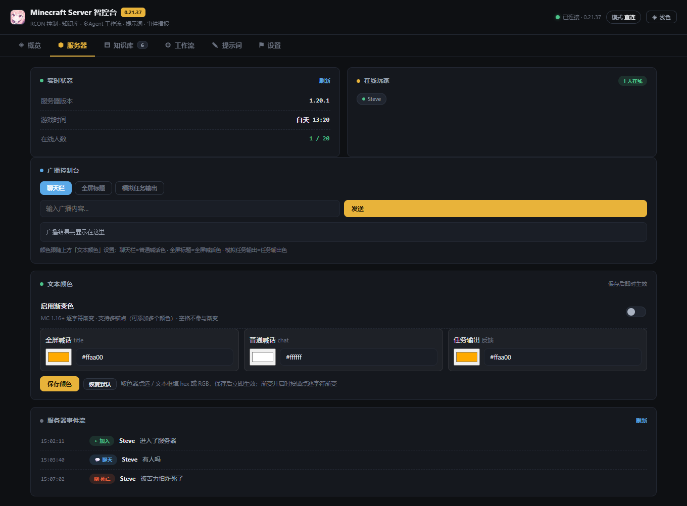

# astrbot_plugin_Scintilla_MC_Server_Control · Minecraft Server 智控台

给 [AstrBot](https://github.com/AstrBotDevs/AstrBot) 用的 Minecraft 服务器控制插件：通过 **RCON** 远程下发指令，并把能力注册成 LLM 工具，用自然语言就能发物品、踢人、广播、查状态；同机部署时还能读服务端日志，把玩家进出 / 聊天 / 死亡 / 成就 / 指令播报到群聊。

> 不修改服务端本身、不依赖模组：只在服务端 `server.properties` 里开一个 RCON 端口即可（Mojang 官方服务端就支持）。

> [!IMPORTANT]
> 本项目大量使用 AI 进行辅助开发，但本人已人工批阅所有代码，并保证可用。

## 文档

| 页面 | 内容 |
|---|---|
| [界面效果](docs/gallery.md) | 六个功能页 + 设置页各分组的实机截图（深浅两套主题） |
| [配置详解](docs/configure.md) | 全部 10 组、78 项配置逐项说明与默认值 |
| [使用指南](docs/usage.md) | 从开 RCON 到自然语言下任务的完整流程、两种部署形态对比 |
| [常见问题](docs/faq.md) | 安装与使用中容易踩到的坑 |

## 界面预览

[](docs/gallery.md)

[](docs/gallery.md)

> 更多界面（知识库 / 工作流 / 提示词 / 设置页十个分组）见 [界面效果](docs/gallery.md)。

---

## 功能一览

| 能力 | 说明 |
|---|---|
| 自然语言指令 | 「给 Steve 发一把钻石剑」→ LLM 调 `mc_give_item`；「把天气设成雷雨」→ `mc_execute_command` |
| 物品 ID 词典 | 扫描服务端 `mods/`（Forge/NeoForge/Fabric）或 `plugins/`（Paper/Spigot 系），生成精确 ID 词典，中英文模糊搜索 |
| 服务器事件播报 | 玩家 进入/离开/聊天/死亡/成就/指令 六类事件推送到指定会话，可逐类开关 |
| 聊天桥接 | 游戏内聊天 ↔ 群聊双向转发（可加符号、区分大小写、留空则转发全部） |
| 多 Agent 工作流 | 复杂整合包任务走 `分类 → 模板判断 → 前瞻建库 → 实现 → 纠错` 流水线，工具 `mc_workflow` 一键路由 |
| 知识库 | 沉淀「物品 ID / NBT 写法 / 满配方案」等经验；按服务端指纹分预设，换服不串库 |
| 外部平台指令组 | `mcs` 指令组：绑定 / 解绑 / 查询 / 喊话 / 状态 / 踢人 / 封禁 / 解封 |
| 权限策略 | 命令工具支持**白名单**（默认，非管理员完全禁用）/ **黑名单** 两种策略，危险命令始终仅管理员 |
| 可视化设置 | 原生配置页 + 插件 WebUI（十个分组、深浅两套主题、顶部吸顶保存条） |

---

## 安装

### 方式一：AstrBot 应用市场（推荐）

在 AstrBot WebUI 打开「插件市场」，搜索 **Minecraft Server 智控台** 或插件 ID `astrbot_plugin_Scintilla_MC_Server_Control`，点一下即可装好；以后本插件发新版本，也能在同一处直接升级（不用手动替换文件）。

### 方式二：手动安装

把本目录放进 AstrBot 的插件目录即可：

```
<AstrBot>/data/plugins/astrbot_plugin_Scintilla_MC_Server_Control/
```

也可以到 [Releases](https://github.com/HuangGuaKnn/astrbot_plugin_Scintilla_MC_Server_Control/releases) 下载打包好的 zip，解压后把整个文件夹放进 `data/plugins/`。

可选依赖：`psutil`（只有 `mcs 状态` 的内存 / CPU / 运行时长需要，缺了会自动降级）。

---

## 配置

### 1. 服务端开 RCON

`server.properties`：

```properties
enable-rcon=true
rcon.port=25575
rcon.password=你的密码
```

改完重启服务端。若 AstrBot 与服务端**不同机**，把 RCON 端口做端口映射后打开插件设置里的「异地 RCON 模式」——此时插件只用 RCON，不读本地文件（见下文「两种部署形态」）。

### 2. 插件侧

在 WebUI「设置」页填写：

| 配置 | 说明 |
|---|---|
| `rcon_host` / `rcon_port` / `rcon_password` | RCON 连接信息 |
| `server_dir` | **服务端根目录**（整合包 / 插件服务端解压后的那一层）。保存时会做结构校验（`logs/`、`libraries/`、`server.properties`、`eula.txt` 等特征），不像服务端根目录会拒绝保存 |
| `admin_ids` | 管理员 ID 列表：拥有全部权限（含危险命令）。群聊里填 QQ 号，WebChat 里填昵称 |
| `notify_targets` / `chat_bridge_targets` | 播报 / 桥接目标会话，格式 `平台ID:消息类型:会话ID`，也支持 `私聊:123456789`、`群聊:987654321` 简写 |

`server_dir` 用不到的三种情况插件会自动降级并明确告知：**未填写**、**结构校验没过**、**异地 RCON 模式**。此时事件播报 / 物品词典 / 知识库 / 版本探测全部停用，只保留纯 RCON 能力（PC 上的 WebUI 会把这些区块磨砂蒙住并写明原因）。

## 权限策略（重要）

命令工具（执行指令 / 发物品 / 广播）受策略闸门保护：

* **白名单（默认）**：非管理员完全不能使用口头命令工具，但保留「mcs 喊话」这类插件本体功能。
* **黑名单**：所有人都能用，但危险命令（stop / op / ban / kick / whitelist 等）与权限等级 ≥ 3 的管理命令仍仅管理员可用。

喊话、状态、查询、绑定这类插件自带功能不受策略影响。策略可在 WebUI「设置 → 权限与安全」里切换。
被闸门拦住时，工具返回的是**终局结论**（插件会同时给出会话级闩锁，避免 AI 反复换参数硬试）。

---

## `mcs` 指令组

在 AstrBot 聊天平台里发（**不是在游戏里输入**，前缀跟随 AstrBot 唤醒词设置）：

```
mcs 绑定 <游戏名>      绑定自己 → 游戏名（之后工具可省略玩家名）
mcs 解绑 / mcs 查询
mcs 喊话 <内容>        带昵称转发到服务器
mcs 状态               mspt / tps / 在线人数 / 运行时长 / 内存 / CPU
mcs 踢人 <玩家> [理由]  （仅管理员）
mcs 封禁 / 解封 <玩家>  （仅管理员）
```

---

## 多 Agent 工作流

复杂任务（数值计算、满配枪械、模组物品、复杂 NBT、批量指令）请让 AI 调用 `mc_workflow`，由流水线统一处理：

```
分类 Agent → 模板判断 Agent → 前瞻建库 Agent → 实现 Agent → 纠错 Agent
```

五个角色的系统提示词可在 WebUI「提示词」页或原生配置「⑩ 多 Agent 提示词」里改，保存即生效。
简单任务不必走流水线：单条原版指令、查玩家、广播直接调对应单工具即可。

---

## 测试

`tests/` 下是回归用例（无 pytest 依赖，直接跑脚本，末尾打印 `全部通过 ✅`）：

```powershell
# 用 AstrBot 自带解释器（<AstrBot>/backend/python/python.exe），或设置 ASTRBOT_APP_DIR
python tests\test_permission_gate.py      # 权限闸门白/黑名单
python tests\test_tool_guard.py           # 「拦截即终局」护栏
python tests\test_remote_rcon_mode.py     # 服务端目录校验 + 异地模式降级
python tests\test_server_identity.py      # 服务端指纹（mods/ 与 plugins/）
python tests\test_fingerprint_notice.py   # 指纹不匹配弹窗轮次记账
python tests\test_kb_entry_edit.py        # 知识条目编辑 / 改名语义
python tests\test_settings_save_resync.py # 保存设置即重算指纹
python tests\ui_theme_check.py            # UI 实跑（Playwright + Edge，会截图）
python tests\make_docs_images.py          # 重拍 docs/ 文档配图（界面改动后跑）
```

UI 用例需要 `playwright`（`pip install playwright`），并会用到系统 Edge / Chromium；截图输出到 `tests/_shots/`（已在 `.gitignore` 里）。
`make_docs_images.py` 另需 `Pillow`，输出到 `docs/images/`（这一份要入库）。
路径一律由 `tests/_paths.py` 自动发现，不写死任何机器路径。

---

## 常见问题

> 下面是高频问题速查；更完整的排查清单见 **[常见问题（完整版）](docs/faq.md)**。

**Q：工具都说「物品词典不可用」？**
服务端目录没配好。到 WebUI「设置」页填 `server_dir` 并保存——保存即重算指纹与词典，不用重载插件。

**Q：换了服务端，知识库会自己切吗？**
不会。指纹变化时插件只在 WebUI 弹全屏提醒并高亮不匹配的预设，是否搬家由你确认（预设支持复制 / 移动 / 绑定到本服务端）。

**Q：AstrBot 和服务端不同机？**
打开「异地 RCON 模式」：只走 RCON，依赖本地文件的功能全部禁用并在界面上写明原因。

**Q：能控制基岩版 / 代理端吗？**
只走 RCON 的标准能力，凡是不经 RCON 的功能（日志播报、词典、指纹）都要求能读到服务端目录。

**Q：tacz 枪械满配这类复杂指令为什么不能稳定成功？**

> [!CAUTION]
> 受 AstrBot 与 Minecraft 服务端**端到端链路**的限制，目前过重的指令任务还不能保证一次成功——比如 tacz 枪械满配这类命令，可能无法稳定触发。
> 插件已用「多 Agent 工作流 + 失败自动纠错重试」尽量兜底，但不承诺 100% 成功率。
> 欢迎到 [Issues](https://github.com/HuangGuaKnn/astrbot_plugin_Scintilla_MC_Server_Control/issues) 提出建议与失败案例，帮助这个项目继续改进。

---

## 许可

MIT（见 `LICENSE`）。本项目与 Mojang / Microsoft 无关联；Minecraft 是 Mojang Studios 的商标。请遵守你所在服务器的规则与 EULA。
